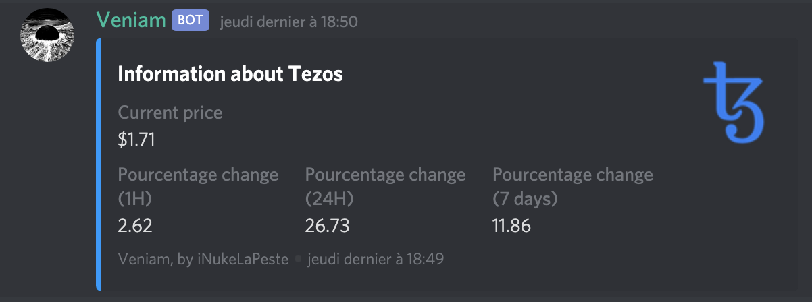

# Veniam
A Discord bot to keep an eye on your favorite cryptocurrencies.

Uses CoinMarketCap API.

## How to get Veniam

```
git clone https://github.com/iNukeLaPeste/Veniam.git
cd Veniam/
npm install
```

You will need a `.env` file like this:
```
TOKEN=YOUR_DISCORD_TOKEN
CMC_TOKEN=YOUR_COINMARKETCAP_API_KEY
```

## How to use Veniam

Once the bot is launched and online, any user can type:
```
!price TICKER_HERE
```

`TICKER_HERE` can be any existing ticker such as BTC, ETH, XTZ, BAT, etc...

## Example

Entering the following command:
```
!price xtz
```
will displays this:

